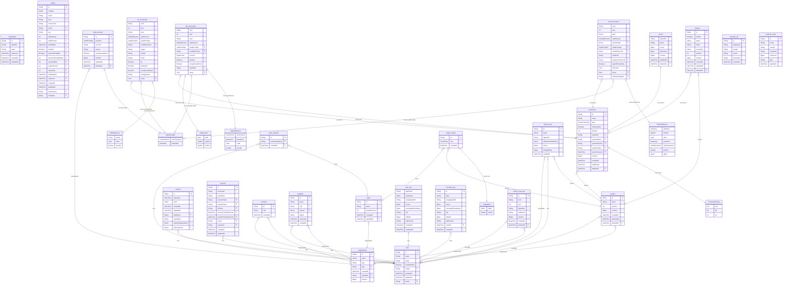

```mermaid
erDiagram

        VaultProvider {
            onePassword onePassword
bitwarden bitwarden
        }
    


        ShareRole {
            editor editor
viewer viewer
        }
    


        ConnectionType {
            ssh ssh
ftp ftp
s3 s3
        }
    


        SshAuthSource {
            inlineKey inlineKey
keyFile keyFile
vault vault
password password
vaultPassword vaultPassword
prompt prompt
agent agent
        }
    


        FtpAuthSource {
            anonymous anonymous
password password
vault vault
prompt prompt
        }
    


        FtpSecurity {
            plain plain
explicit explicit
implicit implicit
        }
    


        S3AuthSource {
            secret secret
vault vault
prompt prompt
        }
    
  "user" {
    String id "🗝️"
    String name 
    String email 
    Boolean emailVerified 
    String image "❓"
    DateTime createdAt 
    DateTime updatedAt 
    String locale "❓"
    }
  

  "session" {
    String id "🗝️"
    DateTime expiresAt 
    String token 
    DateTime createdAt 
    DateTime updatedAt 
    String ipAddress "❓"
    String userAgent "❓"
    String activeOrganizationId "❓"
    String activeTeamId "❓"
    }
  

  "account" {
    String id "🗝️"
    String accountId 
    String providerId 
    String accessToken "❓"
    String refreshToken "❓"
    String idToken "❓"
    DateTime accessTokenExpiresAt "❓"
    DateTime refreshTokenExpiresAt "❓"
    String scope "❓"
    String password "❓"
    DateTime createdAt 
    DateTime updatedAt 
    }
  

  "verification" {
    String id "🗝️"
    String identifier 
    String value 
    DateTime expiresAt 
    DateTime createdAt 
    DateTime updatedAt 
    }
  

  "apikey" {
    String id "🗝️"
    String configId 
    String name "❓"
    String start "❓"
    String referenceId 
    String prefix "❓"
    String key 
    Int refillInterval "❓"
    Int refillAmount "❓"
    DateTime lastRefillAt "❓"
    Boolean enabled "❓"
    Boolean rateLimitEnabled "❓"
    Int rateLimitTimeWindow "❓"
    Int rateLimitMax "❓"
    Int requestCount "❓"
    Int remaining "❓"
    DateTime lastRequest "❓"
    DateTime expiresAt "❓"
    DateTime createdAt 
    DateTime updatedAt 
    String permissions "❓"
    String metadata "❓"
    }
  

  "organization" {
    String id "🗝️"
    String name 
    String slug 
    String logo "❓"
    DateTime createdAt 
    String metadata "❓"
    BigInt revision 
    }
  

  "member" {
    String id "🗝️"
    String role 
    DateTime createdAt 
    }
  

  "invitation" {
    String id "🗝️"
    String email 
    String role "❓"
    String teamId "❓"
    String status 
    DateTime expiresAt 
    DateTime createdAt 
    }
  

  "team" {
    String id "🗝️"
    String name 
    Int memberCount 
    DateTime createdAt 
    DateTime updatedAt "❓"
    }
  

  "team_member" {
    String id "🗝️"
    String membershipKey "❓"
    DateTime createdAt "❓"
    }
  

  "user_key" {
    String algorithm 
    Bytes publicKey 
    String wrapAlgorithm 
    Bytes nonce 
    Bytes encryptedPrivateKey 
    String kdf 
    Bytes kdfSalt 
    String kdfParams 
    DateTime createdAt 
    DateTime updatedAt 
    }
  

  "recovery_key" {
    String id "🗝️"
    String label 
    String wrapAlgorithm 
    Bytes nonce 
    Bytes encryptedPrivateKey 
    String kdf 
    Bytes kdfSalt 
    String kdfParams 
    DateTime usedAt "❓"
    DateTime createdAt 
    }
  

  "vault_account" {
    String id "🗝️"
    VaultProvider provider 
    String account 
    String server 
    Boolean acceptInvalidCert 
    BigInt revision 
    DateTime updatedAt 
    DateTime deletedAt "❓"
    }
  

  "project" {
    String id "🗝️"
    String name 
    Int position 
    BigInt revision 
    DateTime createdAt 
    DateTime updatedAt 
    DateTime deletedAt "❓"
    }
  

  "project_share" {
    String id "🗝️"
    ShareRole role 
    DateTime createdAt 
    }
  

  "project_key" {
    String id "🗝️"
    String keyId 
    String algorithm 
    Bytes ephemeralPublicKey 
    Bytes nonce 
    Bytes wrappedKey 
    DateTime createdAt 
    }
  

  "connection" {
    String id "🗝️"
    String name 
    ConnectionType type 
    Boolean bookmarked 
    Int position 
    String systemId "❓"
    String systemName "❓"
    String systemVersion "❓"
    String systemPretty "❓"
    DateTime systemSeenAt "❓"
    BigInt revision 
    DateTime createdAt 
    DateTime updatedAt 
    DateTime deletedAt "❓"
    }
  

  "ssh_connection" {
    String host 
    Int port 
    String user 
    SshAuthSource authSource 
    String keyFilePath "❓"
    VaultProvider vaultProvider "❓"
    String vaultReference "❓"
    String startPath 
    String jumpConnectionId "❓"
    Boolean agentForwarding 
    Json forwards "❓"
    Json proxy "❓"
    String startupSnippetId "❓"
    }
  

  "ftp_connection" {
    String host 
    Int port 
    String user 
    FtpAuthSource authSource 
    VaultProvider vaultProvider "❓"
    String vaultReference "❓"
    FtpSecurity security 
    Boolean passive 
    Boolean acceptInvalidCert 
    String startPath 
    Json proxy "❓"
    }
  

  "s3_connection" {
    String host 
    Int port 
    String user 
    S3AuthSource authSource 
    VaultProvider vaultProvider "❓"
    String vaultReference "❓"
    String region 
    String bucket 
    String prefix 
    Boolean tls 
    Boolean pathStyle 
    Boolean acceptInvalidCert 
    String storageClass 
    Json proxy "❓"
    }
  

  "secret" {
    String algorithm 
    String keyId 
    Bytes nonce 
    Bytes ciphertext 
    BigInt revision 
    DateTime updatedAt 
    DateTime deletedAt "❓"
    }
  

  "known_host_key" {
    String id "🗝️"
    String host 
    Int port 
    String algorithm 
    String publicKey 
    BigInt revision 
    DateTime createdAt 
    DateTime deletedAt "❓"
    }
  

  "snippet" {
    String id "🗝️"
    Boolean locked 
    String name 
    String folder 
    String command 
    Int position 
    BigInt revision 
    DateTime createdAt 
    DateTime updatedAt 
    DateTime deletedAt "❓"
    }
  

  "external_ref" {
    String id "🗝️"
    String entityType 
    String localId 
    String issuer 
    String externalId 
    DateTime createdAt 
    }
  

  "external_event" {
    String id "🗝️"
    String issuer 
    String eventId 
    String scopeKey 
    BigInt sequence 
    String type 
    DateTime appliedAt 
    }
  
    "session" }o--|| "user" : "user"
    "account" }o--|| "user" : "user"
    "member" }o--|| "organization" : "organization"
    "member" }o--|| "user" : "user"
    "invitation" }o--|| "organization" : "organization"
    "invitation" }o--|| "user" : "user"
    "team" }o--|| "organization" : "organization"
    "team_member" }o--|| "team" : "team"
    "team_member" }o--|| "user" : "user"
    "user_key" |o--|| "user" : "user"
    "recovery_key" }o--|| "user" : "user"
    "vault_account" |o--|| "VaultProvider" : "enum:provider"
    "vault_account" }o--|| "organization" : "organization"
    "project" }o--|| "organization" : "organization"
    "project" }o--|o "user" : "createdBy"
    "project_share" |o--|| "ShareRole" : "enum:role"
    "project_share" }o--|| "project" : "project"
    "project_share" }o--|o "team" : "team"
    "project_key" }o--|| "project" : "project"
    "project_key" }o--|| "user" : "user"
    "project_key" }o--|o "user" : "grantedBy"
    "connection" |o--|| "ConnectionType" : "enum:type"
    "connection" }o--|| "project" : "project"
    "ssh_connection" |o--|| "SshAuthSource" : "enum:authSource"
    "ssh_connection" |o--|o "VaultProvider" : "enum:vaultProvider"
    "ssh_connection" |o--|| "connection" : "connection"
    "ftp_connection" |o--|| "FtpAuthSource" : "enum:authSource"
    "ftp_connection" |o--|o "VaultProvider" : "enum:vaultProvider"
    "ftp_connection" |o--|| "FtpSecurity" : "enum:security"
    "ftp_connection" |o--|| "connection" : "connection"
    "s3_connection" |o--|| "S3AuthSource" : "enum:authSource"
    "s3_connection" |o--|o "VaultProvider" : "enum:vaultProvider"
    "s3_connection" |o--|| "connection" : "connection"
    "secret" |o--|| "connection" : "connection"
    "known_host_key" }o--|| "organization" : "organization"
    "known_host_key" }o--|o "user" : "trustedBy"
    "snippet" }o--|| "project" : "project"
    "snippet" }o--|o "connection" : "connection"
```
